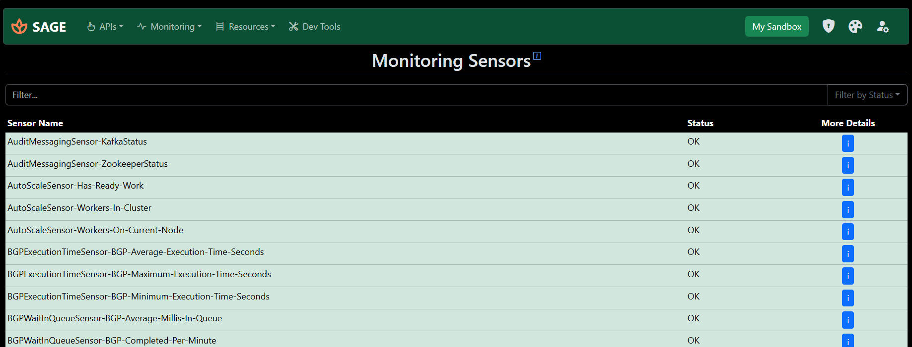

# SAGE - STEP API Gateway Engine

## The Swiss Army Knife for Stibo STEP Developers.

**SAGE** might be your new best friend if you work with the <a href="https://www.stibosystems.com/platform" target="_blank">Stibo STEP MDM platform</a>.

It streamlines your development workflow by bringing multiple environments, APIs, and monitoring tools in one place. You can work with, monitor, and apply changes on your STEP system from one unified dashboard.

> This started as a hobby project to scratch my own itch to build something to complement STEP. It quickly evolved into a robust tool that I feel most developers can use daily. I built this to make *our* lives easier. Feedback is super welcome!

<br>

> **AI Disclosure:** This app is AI-assisted, not AI made. This means that I used AI during development to assist in some parts, but every line of code is reviewed and tested by me.


## Main Features

*   **System Management**: Configure and switch between multiple STEP systems.
*   **API Integartions**:
    *   **REST API**: Ability to run all STEP RESTAPI V2 commands
    *   **GraphQL**: Execute any GraphQL query
    *   **Console Mode**: Custom built click-and-go **quality of life features** combining the best of both APIs.
*   **Monitoring**:
    *   **Healthchecks**: View results of STEP's pre configured tests.
    *   **Sensors**: Real-time system monitoring via sensors.
*   **Developer Toolkit**: Utilities for your day-to-day tasks.
*   **Pro Tips**: Best practices, how-to's, and tips & tricks based on real-world experience.

> Note that the above features are tested and confired working on the newer version of SaaS STEP (2024.X+). Most of them will also run on older versions, but there's no guarantee of it.

>  **Special thanks to Stibo Systems for providing the sandbox environments for testing.**


## Screenshots
<details>
<summary>Click to open</summary>

**Homepage**


**Systems Page**


**REST API Interface**


**GraphQL Interface**


**Console Interface**


**Sensors**


**Healthchecks**


**Tools**

</details>

## Installation

<strong>1. Manual Deployment </strong>

**Prerequisites:** Python (latest) and `pip`.

1. **Clone the repo.**
   ```
   git clone https://github.com/sabino-pereira/SAGE.git
   ```
2. **Open your terminal** in the project folder.
   ```
   cd SAGE
   ```
3. **Create a python virtual environment:**
   ```
   python3 -m venv venv
   ```
4. **Activate it:**
  *   Linux/Mac: `source venv/bin/activate`
  *   Windows: `.\venv\Scripts\activate`
5. **Install the dependencies:**
   ```
   pip install -r requirements.txt
   ```
6. **Set up security:**
  Create a `.env` file in the root directory and set:
   ```
   SECRET_KEY=your-super-secret-key
   ```
   *Tip: Generate a strong key with `python3 -c "import uuid; print(uuid.uuid4().hex)"` or by bashing your head on the keyboard*

7. **Initialize the Database:**
   ```
   mkdir db
   flask db init --directory db/migrations
   flask db migrate --directory db/migrations -m "Initiating"
   flask db upgrade --directory db/migrations
   ```
8. **Launch!**
   ```
   flask run
   ```
9. Access the application at `http://localhost:3110` (or <server-ip:3110>).


<br>

<strong>2. Docker </strong>
   1. Make sure you have docker installed on your machine
   2. Create a new directory to store everything
      ```
      mkdir -p sage/db
      cd sage
      ```
   3. Run the docker command:
      ```
      docker run -d --name sage -p 3110:3110 -e SECRET_KEY=<secret-key> -v ./db:/sage/db ghcr.io/sabino-pereira/sage:latest
      ```
   4. If you prefer to use docker-compose:
      ```
      services:
        sage:
          image: ghcr.io/sabino-pereira/sage:latest
          container_name: sage
          restart: unless-stopped
          user: 1000:1000
          environment:
            SECRET_KEY= <secret-key>
          ports:
            - 3110:3110
          volumes:
            - ./db:/sage/db
      ```
   5. Access the application at `http://localhost:3110` (or <server-ip:3110>).
   
<br>


Once you're up and running, check the built-in docs for a tour.

---

## Tech Stack

*   **Python**
*   **Flask** (plus extensions)
*   **Bootstrap 5**