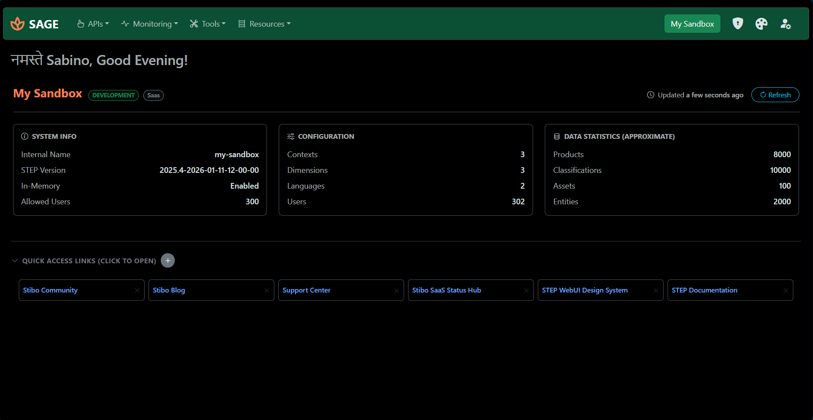
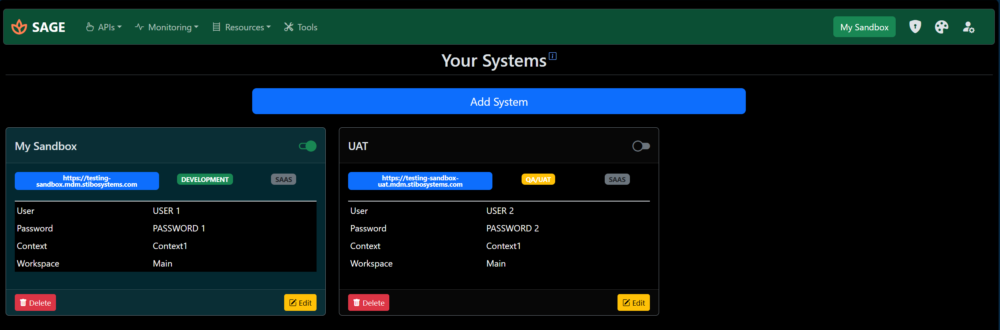
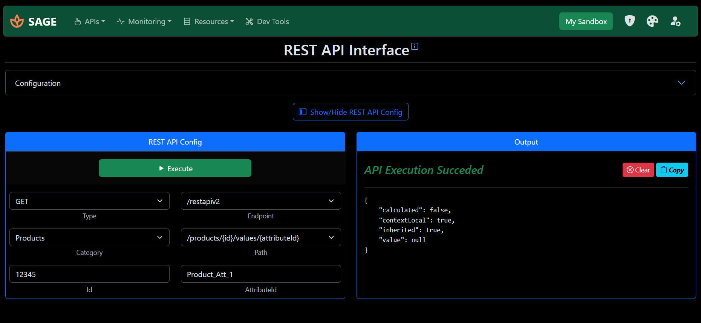
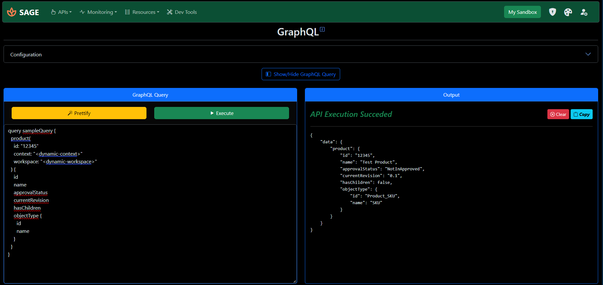
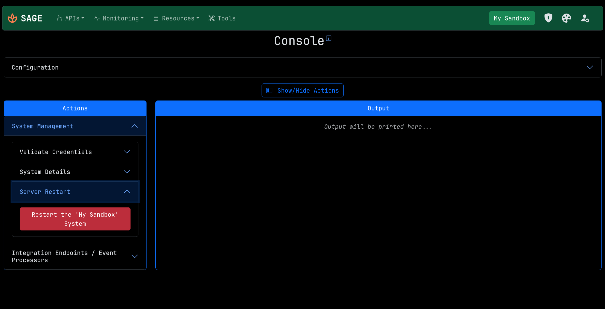
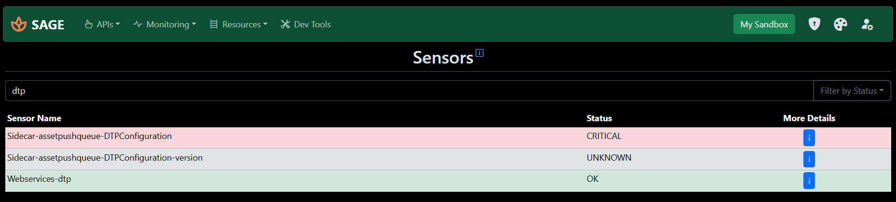
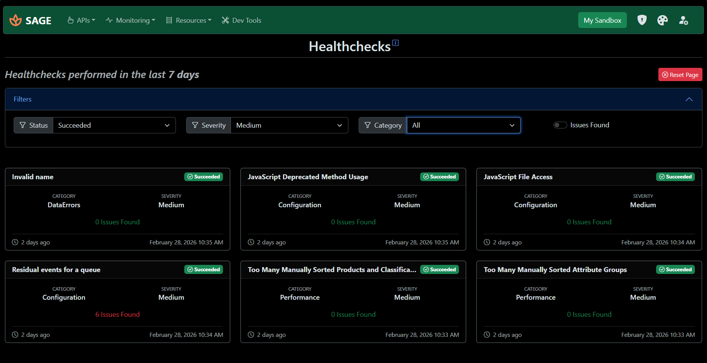
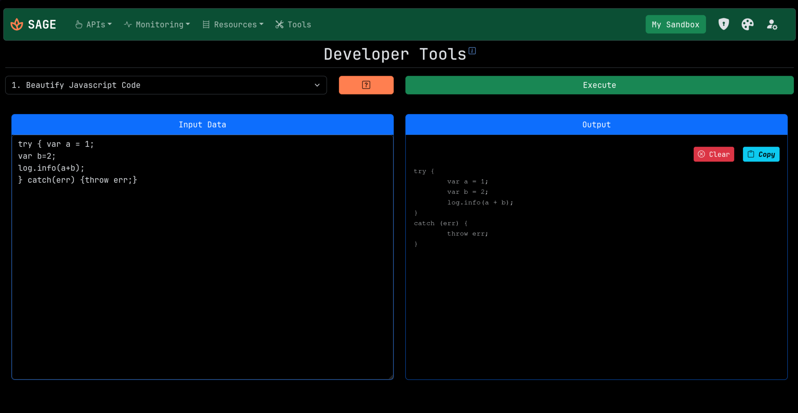

# SAGE - STEP API Gateway Engine


## About the Project

**SAGE** might be your new best friend if you work with the [Stibo STEP MDM platform](https://www.stibosystems.com/platform). Built to scratch a personal itch within to create something within the Stibo STEP ecosystem, this tool has evolved from a hobby project into a robust tool that can help developers in their daily work. Think of it as a centralized dashboard to manage and monitor multiple Stibo STEP instances. Feedback is always welcome, please open an issue or discussion if you have ideas for improvements.


## Features

1. System Management:
   - Add, edit, and remove STEP instance (system) links.
   - Instantly switch between systems.
2. API Integrations:
   - REST API: Ability to run all STEP RESTAPI V2 commands
   - GraphQL: Execute all GraphQL queries
   - Console Mode: Custom built click-and-go **quality of life features** combining the best of both APIs.
3. Monitoring:
   - Healthchecks: View results of STEP's pre configured tests.
   - Sensors: Real-time system monitoring via sensors.
4. Developer Toolkit: 
   - Utilities for your day-to-day tasks.
   - Code formatting tools like javascript and xml.
5. Pro Tips
   - Best practices, how-to's, and tips & tricks based on my experience.
6. Responsive UI for both deskto and mobile usage


## Note

1. #### Privacy & Hosting

- This app is meant to be Self-Hosted. You have total control, there is no tracking, telemetry, or "phoning home".

- Data Ownership: As a self-hosted app, the first registered user (Admin) has full visibility into the local database and usage statistics.

2. #### AI Disclosure

- This app is AI-assisted, but not AI made. This means that I took help from AI (Gemini specifically) during development when I was stuck at some points, but every line of code is reviewed and tested by me, as well as the entire design is made by me.

3. #### License

- Licensed under GPLv3. Use it, modify it, and share it—just remember that any distributed derivative works must also be open-sourced under the same terms.


<br>


## Demo Instance:
>If you want to see for yourself how it works, check out the below link and credentials. Just remember to not add your own system credentials on there as others can also see it.
- URL - https://sage.sabino.in
- Username - demo
- Password - demodemo


<br>

## Screenshots
<details>
<summary>Click to expand</summary>

**Homepage**


**Systems Page**


**REST API Interface**


**GraphQL Interface**


**Console Interface**


**Sensors**


**Healthchecks**


**Tools**

</details>

<br>
<br>

## Installation

<strong>1. Manual Deployment </strong>

**Prerequisites:** Python (latest) and `pip`.

1. **Clone the repo.**
   ```
   git clone https://github.com/sabino-pereira/SAGE.git
   ```
2. **Switch to the project folder.**
   ```
   cd SAGE
   ```
3. **Open a terminal and create a python virtual environment:**
   ```
   python3 -m venv venv
   ```
4. **Activate it:**
  *   Linux/Mac: `source venv/bin/activate`
  *   Windows: `.\venv\Scripts\activate`
5. **Install the dependencies:**
   ```
   pip install -r requirements.txt
   ```
6. **Set up a secret key:**
  Create a `.env` file in the root directory and set:
   ```
   SECRET_KEY=<your-secret-key>
   ```
   *Tip: Generate a strong key with `python3 -c "import uuid; print(uuid.uuid4().hex)"` or by bashing your head on the keyboard*

7. **Initialize the Database:**
   ```
   mkdir db                                                    -> Linux only
   flask db init --directory db/migrations
   flask db migrate --directory db/migrations -m "Initiating"
   flask db upgrade --directory db/migrations
   ```
8. **Launch!**
   ```
   flask run
   ```
9. Access the application at `http://localhost:3110` (or <your-server-ip:3110>).


<br>

<strong>2. Docker </strong>
   1. **Make sure you have docker installed on your machine**
   2. **Create new directories to store everything**
      ```
      mkdir -p sage/db
      cd sage
      ```
   3. **Run the docker image**:
      ```
      docker run -d --name sage -p 3110:3110 -e SECRET_KEY=<secret-key> -v ./db:/sage/db ghcr.io/sabino-pereira/sage:latest
      ```

      The secret key needs to be generated, it can be anything, but make it complex for better security.
   4. **If you prefer to use docker-compose**:
      ```
      services:
        sage:
          image: ghcr.io/sabino-pereira/sage:latest
          container_name: sage
          restart: unless-stopped
          user: 1000:1000
          environment:
            SECRET_KEY= <secret-key>
          ports:
            - 3110:3110
          volumes:
            - ./db:/sage/db
      ```
   5. Access the application at `http://localhost:3110` (or <server-ip:3110>).
   
<br>


Once you're up and running, check the built-in docs for a tour and explanation of the basic of the app.

---

## Tech Stack

1.   **Python**     -> Main Language
2.  **Flask**       -> Web Framewrok
3. **Bootstrap 5**  -> For Web Design

<br>

>Special thanks to [this incredible blog](https://blog.miguelgrinberg.com/post/the-flask-mega-tutorial-part-i-hello-world) by **Miguel Grinberg** that taught me how to use flask.